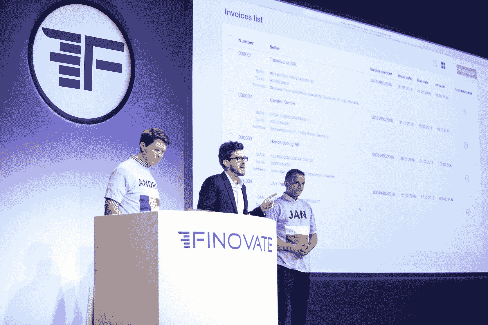
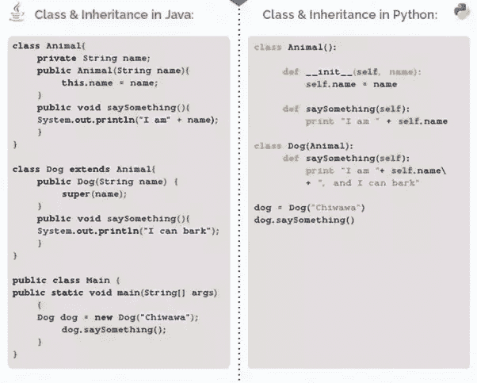

# 为什么 Python 应该是你的金融科技的技术选择

> 原文：<https://www.stxnext.com/blog/why-python-should-be-technology-choice-your-fintech/>

 在创建金融科技初创公司的早期，你将不得不做出很难取消的关键决定。

其中一个决定是你对技术栈的选择，主要是编程语言。如果你在这里出了问题，你的成本可能会直线上升，让你陷入赤字，尽管你有最好的意图。

你的 fintech 需要一种易于操作、可扩展、成熟、高性能的编程语言，再加上现成的库和组件。

幸运的是，  [Python](https://stxnext.com/services/python-development/) 可以满足你所有的金融科技需求。

继续阅读了解  [为什么 Python 是最聪明的选择](https://stxnext.com/ebooks/what-is-python-used-for/) 编程语言为  [fintech](/services/fintech-development/) 。

 

#### 发现 Python 在 fintech 中的应用和普及

在加入 STX Next 之前，我为一家很有前途的波兰金融科技公司工作。虽然我的功绩是短暂的，最终在 Finovate Europe 2016 上赢得了“最佳表演奖”(见视频[FinovateEurope 2016:Valuto](http://finovate.com/videos/finovateeurope-2016-valuto/))，但我确保我的下一个努力将使我与该行业保持联系。

当我加入欧洲最大的 Python 软件公司时，我很兴奋地了解到后端语言在金融科技中是多么普遍——无论是初创公司还是独角兽。

**Finovate Europe 2016**

对于那些可能第一次接触这个术语的人来说，fintech 结合了硅谷的技术和伦敦、纽约或新加坡的金融服务。根据年度[金融科技报告](http://www.pwc.com/gx/en/industries/financial-services/fintech-survey/report.html)，2017 年全球累计投资将超过 1500 亿美元。

许多熟悉 fintech 的人可能不熟悉它与 Python 的联系。自 2015 年以来，许多金融行业招聘  [Python 开发人员](https://hackernoon.com/top-10-python-django-web-application-development-companies-eda8461c764f) 的工作岗位证明了 Python 作为一种编程语言的受欢迎程度上升——大约在金融科技开始获得主流恶名的时候。

 

#### 为什么 Python 是金融科技初创公司最有用的编程语言

Python 是金融业的理想编程语言。在投资银行和对冲基金行业，银行普遍使用 Python 来解决定价、交易管理和风险管理平台的量化问题。

在分析、监管、合规和数据方面，Python 似乎也有解决金融行业提出的大多数挑战的答案，大量的支持库使这些挑战变得很容易。(稍后将详细介绍这些内容。)

我不想阻止那些使用其他服务器端语言来自举 fintechs 的人。大多数将允许您完成类似的目标，事实上，许多公司使用几种后端语言来构建他们的产品。

然而，尽管如此，还是有一些技术可以帮助你以更快更直观的方式实现你的目标。我相信许多人都会有自己的理由，为什么他们最喜欢的后端技术对金融科技来说是理想的，这很好，但我打算在下面的段落中停止大部分辩论。

我马上就把我的情况说清楚:Python 是金融领域发展最快的技术，非常适合你下一次进入金融科技领域。让我告诉你为什么它是理想的。

##### 1.黑客排名编码访谈

在选择技术组合时，对于金融科技公司的首席执行官或首席技术官来说，考虑支持这些技术的劳动力当前和未来的可用性非常重要。这可以通过跟踪教育中的[栈溢出流量](https://stackoverflow.blog/2017/09/06/incredible-growth-python/)或者通过招聘来实现。

由 HackerRank 进行的一项  [2016 年研究](https://blog.hackerrank.com/emerging-languages-still-overshadowed-by-incumbents-java-python-in-coding-interviews/) 调查了六个特定行业最受欢迎的编程语言:医疗保健、社交媒体、游戏&媒体、安全、金融和金融科技。

这些图表是根据 3000 个编码面试挑战的数据制作的，显示出尽管许多行业在顶级编程语言之间存在微小差异，但金融科技甚至没有接近。

事实上，对于 fintech 来说，Python 在编码面试挑战中的排名是第二频繁的编程语言的 2 倍。亚军？Java，在过去的十几年里一直主导着金融服务软件开发。

此外，在这项研究中，HackerRank 确认 Python 通常是金融领域发展最快的语言。

##### 2.使用 Python 的金融巨头

在回顾了劳动力储备和招聘趋势之后，知道你最终选择的编程语言有良好的记录是很重要的。此外，在处理金融行业的典型问题时，比如速度、可伸缩性和定量问题解决，它不应该让你处于劣势。

尽管 Python 绝不是一门新语言，但它在投资银行和对冲基金行业日益流行却是一个相对较新的发展。Python 在金融服务巨头中无处不在，这在很大程度上要归功于 Kirat Singh。如果你没听说过辛格，读一读这位投资银行大师  [如何辞职创办自己的公司](http://news.efinancialcareers.com/uk-en/173476/investment-banking-tech-guru-quits-starts-firm))。

他引入 Python 的原因？在 2014 年接受 eFinancialCareers 采访时，辛格(美银美林前董事总经理)说:

> ***“它是一种很好的脚本语言，可以轻松地集成到前端和后端，这也是我们当初选择它的原因之一。”***
> 
> ***—基拉特·辛格***

Python 是 J.P. Morgan 的 Athena 程序和美国银行的 Quartz 程序的核心语言。辛格接着说:“现在，摩根大通的每个人都需要了解 Python，美国银行有大约 5000 名开发人员在使用它。Quartz 中有近 1000 万行 Python 代码，我们每天有近 3000 次提交。”

截至 2018 年 6 月，花旗集团加入了越来越多的希望其分析师和交易员拥有强大 Python 编码技能的投资银行名单。今年 7 月，该集团将  [Python 培训课程](https://www.bloomberg.com/news/articles/2018-06-14/citi-wants-analysts-to-add-python-to-list-of-languages-on-resume) 添加到了教授给新聘银行分析师的课程中。

但是花旗集团的 Python 培训努力并不止于此。除了最近的招聘，他们还提高了经理的技能，甚至让该集团的市场和证券主管 Paco Ybarra 上了 Python 课程的一个版本。

尽管摩根大通(J.P. Morgan)、美国银行(Bank of America)和花旗(Citi)应该被列入你作为一名金融科技高管试图推翻的现任者名单，但这确实为这一措辞首先适用于金融服务增加了一些分量。

 

#### 是什么让 fintechs 和 Python 完美结合

##### 1.简单

开发一个金融服务平台已经是一项相当复杂的任务。为什么不使用开发人员认为易于编码和部署的语言来简化这项工作呢？

Python 因其更简单的语法和比其他传统语言(如 Java 或 C++)更快的编程速度而闻名。当我加入 STX Next 时，我们的首席执行官 Maciej Dziergwa 告诉我，程序员可以用 10 行 Python 代码做 20 行 Java 代码做的事情，而且出错的可能性更小。鉴于金融科技行业的监管程度越来越高，降低错误率对金融科技首席执行官和首席技术官的重要性就变得显而易见了。

需要更多证据吗？

让我们用一个例子，通过使用处理类和继承的方式，来演示 Python 与其他编程语言相比有多简单。下面，您将看到 Python 和 Java 中的代码。

**Source: [quora.com](http://quora.com/)**

那是 Python 的 1，Java 的 0！

##### 2.软件开发成本和上市时间

Python 速度很快。  *(提示蟋蟀。)*

好吧，所以我可能会遭到正在阅读这篇文章的开发者的强烈反对。就性能而言，Python 并不被广泛认为是最快的语言。然而，对于想推出金融科技产品的人来说，让我解释一下我自己。

当我说“快”时，我指的不是 CPU 周期，而是一个不同的指标:上市时间。

总而言之，拥有一个快速的产品或网络应用应该排在你能多快将产品推向市场之后。随便问一个 C 级高管就知道了。(声明一下，我不是说 Python 的性能慢；参见  [PayPal 的 10 大企业 Python 神话](https://www.paypal-engineering.com/2014/12/10/10-myths-of-enterprise-python/#python-does-not-scale)。)

如今，公司最昂贵的资源是员工的时间。作为一家小型金融科技初创公司，你必须注意自己的底线。在大多数情况下，你会有天使投资人或风险投资人观察你，并对你抱有同样的期望。作为一种动态类型语言，Python 为 fintechs 提供了一种比静态类型语言更快的替代方法。

请看这篇  [2006 年的研究](http://www.connellybarnes.com/documents/language_productivity.pdf)，它追踪了用各种编程语言编写代码所花的时间。

**Source: [connellybarnes.com](http://connellybarnes.com/)**

当你预算有限，需要立即在市场上验证你的产品时，正确的服务器端语言变得更加重要。Python 提供了更快的部署和更少的代码需求。

##### 3.更大的协作

作为一名金融科技高管，你很可能来自金融、学术或技术背景。不管是哪一种，你团队中的其他人可能会用一两种上述角色来补充你的技能。

最重要的是，您的工程团队将在一个快节奏的协作环境中工作，与来自不同背景和角色的团队成员一起创造产品。Python，以其简单的组成，允许开发人员在项目上与专业人员更紧密地合作，如定量研究人员、分析师、数据工程师和您——首席执行官。

随着技术人员越来越多地接触到业务的财务方面，或者相反，Python 将会越来越流行。

##### 4.开源金融图书馆

作为一种编程语言，Python 的主要优势之一是可以使用大量的库和工具。作为数学编程的关键语言，这对金融公司很重要，Python 提供了许多金融和 fintech 库。

**下面是金融科技公司使用的一些最好的 Python 库的列表:**

*   **【SciPy】**(科技计算库)，
*   **NumPy** (科学计算基础包)，
*   **熊猫** (灵活强大的数据分析/操纵库)，
*   **pyalgotrade**(算法交易库)，
*   **pyrisk** (常见的财务风险和业绩)、
*   (一个 Pythonic 算法交易库)，
*   **【quantecon . py】**(数量经济学库)、
*   (投资组合与风险分析)，
*   **pybitcointools**(常识比特币主题 Python ECC 库)
*   **finmarketpy** (回溯测试交易策略和分析金融市场的库)，
*   **scikit——学习** ( [机器学习](https://stxnext.com/services/machine-learning/) 算法)，
*   **ffn**(Python 的一个财务函数库)、
*   **pynance** (用于检索、分析和可视化股票和衍生品市场数据的开源软件)。

知道应该加入这个列表的图书馆吗？请在评论区告诉我们吧。

#### 摘要

对于金融科技的创始人来说，选择构成核心产品的语言和框架将对产品的生命周期产生严重影响。语言和框架决定了你能接触到的人才，你能构建的金融产品的种类，你能多快在市场上验证你的产品，以及——在许多方面——你的团队将如何合作。

因此，如果有人问你 Python 在金融科技领域的可行性，现在你知道该怎么回答他们了:

*   Python 的简单性导致了  **更低的错误率和更少的漏洞搜寻。**
*   Python 可能不是执行速度最快的语言，但它是最佳上市时间的  t **op 选择。**
*   Python 的简单语法将  **促进开发人员、技术专家和高级管理人员之间的协作** 。
*   最后，Python 丰富的开源库为 fintech 中的很多常见问题提供了**现成的**解决方案 。

即使有以上所有的论据，还是不相信？想了解更多关于现有金融科技高管选择 Python 进行支付、银行、保险和替代金融金融科技的信息吗？

只需看看我们的 [将 Python 纳入其技术体系的 17 家顶级金融科技公司](/blog/top-15-fintech-companies-include-python-their-tech-stack/)和 [9 家将 Python 纳入其技术体系的保险科技公司——以及为什么它是合适的](/blog/7-insurtech-companies-python-their-tech-stack-and-why-its-fit/)。

