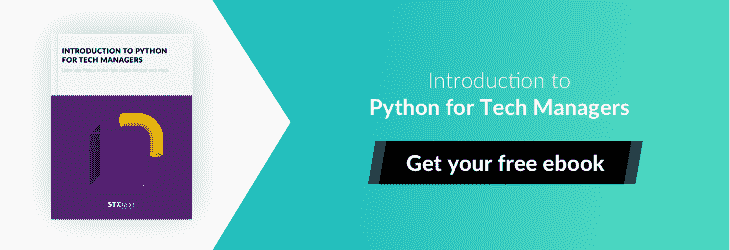

# 为什么 Python 应该是你创业的编程语言

> 原文：<https://www.stxnext.com/blog/why-python-should-be-the-programming-language-for-your-startup/>

*Updated September 12, 2019.*

从一开始，  [所有的创业公司都面临着一个至关重要的决定](http://stxnext.com/what-is-python-used-for/#startups) 挑选合适的编程语言。考虑到可供选择的选项多种多样，做出这个决定并不容易，PHP、  [和 Python](https://stxnext.com/python-vs-other-programming-languages/) 只是其中的几种。

你应该明智地选择，因为  **一种面向未来的编程语言可以帮助你避免这些常见的问题:**

1.  上下伸缩开发团队
2.  内部整合
3.  **实现新功能。**

让我们也不要忘记进行市场调查的重要性。在现有的编程语言中，并不是所有的语言都适合您的项目和客户。**了解你的市场将决定你创业的成败。**

这就是为什么您希望确保您最终选择的编程语言能够满足潜在客户的需求，并且有利于您的业务增长。简而言之，如果你的客户开心，你也开心。

*创业需要什么？三件简单的事情:比任何人都了解你的产品，了解你的客户，并且有强烈的成功欲望。*

迪夫·托马斯，温迪快餐的创始人

在本文中，我们将向您展示为什么您应该考虑将 Python 作为您创业的编程语言。我们还会给你一些已经使用 Python 获得竞争优势的创业公司的例子。

 

#### 创业公司和其他公司有什么不同？

首先，让我们从总体上谈谈创业公司。

坎迪斯·兰道(Candace Landau)在她关于 Bplans 的  [文章](https://articles.bplans.com/whats-difference-small-business-venture-startup/) 中写道，传统企业和创业公司最大的区别是  **增长**、 或者更确切地说是它们的速度。

初创公司应该快速成长，同时开发一种有潜力大规模销售的产品，但大多数企业都不是这样。

兰道认为，这解释了为什么大多数初创公司都是科技初创公司  **。** 网上经营不受时间和空间的限制；无论您身在何处，您的客户都可以随时购买或使用您的产品。

但这还不是全部。创业公司与其他公司的区别还有多个其他因素，其中最重要的是  **【预算】****盈利能力** 。

##### 1.预算

在创业之初，大多数初创企业的财务状况通常比老牌企业差。那些已经尝试过的人知道，为你的初创公司分配资本是困难的，但对于成功筹集下一轮资金是必不可少的。

Traditional accounting for most early stage tech startups is a waste of valuable time.[Lucas Matheson](https://techcrunch.com/2015/11/01/startup-budgets-and-timing-burn-are-founders-winging-it/), CEO @ Pinshape

##### 2.时间

很多创业公司需要迅速行动，让合作伙伴和投资者看到他们项目背后的潜力。这使得时间成为一个关键因素。

Python 的众多优势之一是，它允许你在合理的时间框架内完成一个项目，例如，与使用 Java 实现相同目的相比，更快。说到  [码长](http://qr.ae/TU8dhE)更是如此。

许多程序员同意，使用 Python，你只需为相同的功能编写更少的代码。想知道原因就继续读下去(提示:是  [Django](/services/django-development/) )。

##### 3.收益性

在大多数情况下，初创公司希望他们的产品尽快开始产生利润。没有它，它们就不能生长，有时甚至不能生存。

然而，现实是，创业公司几乎总是  **复杂的企业** ，它们需要一段时间才能盈利。

#### python——创业的编程语言

这似乎是一个很大的杂耍，不是吗？尤其是如果你才刚开始。

幸运的是，Python 可以解决您的问题。

下面列出了 Python 是你创业的最佳选择的主要原因:

##### 1.Python 是用户友好的

Python 因其直观和易于使用而受到软件社区的重视和赞赏。这些吸引人的品质通常是许多初创公司选择 Python 作为编程语言的决定性因素。

##### 2.Python 是创新的

可以理解的是，许多新来者更喜欢 Python 而不是其他语言，但是像 Quora、Instagram 甚至 Google 这样的大联盟玩家也依赖于用 Python 编写的代码——这是为什么呢？

因为 Python 是创新的，它是通用的，它允许您将服务提升到新的高度。无论您需要什么，Python 都能满足您。

##### 3.Python 无处不在

如今，从 Reddit 到 YouTube，Python 无处不在。它的受欢迎程度正在上升，对它的支持也在不断增长。作为你未来计划的一部分，你最好为你的创业公司选择一门语言。

##### 4.Python 是健壮的

流媒体项目或社交网络等初创企业通常都是基于网络的。网络是由大数据驱动的。

这对你来说意味着什么？处理的复杂性和难度。值得庆幸的是，Python 能够很好地应对这种挑战，非常适合初学者。

##### 5.Python 是可扩展的

对于初创公司来说，抓住成功的浪潮并在它持续的时候乘势而上是至关重要的，但你的企业需要准备好快速应对这样的增长。这就是 Python 发挥作用的地方。

这种语言的核心是简单，这意味着你能够克服前进道路上的任何障碍，并按照自己的意愿继续成长。这反过来又意味着未来几年只会有好事情发生。

 

#### Django web 框架如何帮助你的创业

虽然选择你的编程语言是第一步，也是最重要的一步，但你的工作还没有完成——你还需要 [选择你的 web 框架](https://stxnext.com/blog/2018/09/27/beginners-introduction-python-frameworks/)。

这就是事情变得有点棘手的地方。毕竟可供选择的 web 框架是广泛的，退一步说，  **Python 也不例外** 也是如此。

你需要知道的是，现在最流行的 Python 框架是  **[Django](/blog/best-django-tutorials/) 。** 事出有因。

如今，科技创业公司非常吃香。因此，构建 web 应用程序需要轻松愉快。Django 的实用设计和易用性正面满足了这些期望，导致其受欢迎程度快速持续增长。

程序员对 Django 框架最欣赏的三个特性是  **支持性、** 和 **安全性。**

##### 1.支持

世界各地强大的专业人士社区是 Python 最伟大的方面之一。

Django 是由 Django 软件基金会或 DSF 开发和维护的，这意味着 Django 文化的基础有自己的行为准则。多酷啊。

许多其他社区，如 IRC 或邮件列表，都不受欢迎，有时甚至是有害的。姜戈的情况正好相反，我敢说，支持是友好的。

当然，没有什么是完美的，偶尔的打嗝是不可避免的，但这些通常都能快速有效地解决。此外，正是由于这些政策，许多像 Django Girls 这样的团体不仅存在，而且蓬勃发展。

##### 2.可量测性

通常情况下，你很难预测可伸缩性何时会成为你的公司的优先事项，尤其是如果你是一家初创公司。

这就是为什么它是一个好主意使用一种易于维护和扩展的语言。

在它的核心，Django 是一系列组件，默认情况下已经连接好，随时可用。由于这些组件是解耦的——也就是说，彼此独立——如果您的项目需要更具体的解决方案，它们可以被拔掉并替换。

##### 3.安全性

Django 具有内置特性，可以防止大量常见的安全问题发生。

该框架屏蔽或隐藏了您站点的源代码，使其无法在互联网上直接查看。它通过动态生成网页和使用向网络浏览器发送信息的模板来实现。

通过这个过程，你的软件比使用 PHP 时更安全。

 

#### 用 Python 构建您的 MVP

确保你的创业成功需要做出许多有用的决定。其中之一就是决定你应该如何为你的项目构建一个最小可行产品。

MVP 是你的产品的基本版本，还没有提供你所设想的所有功能。相反，它包含了使产品有趣的最少的功能。在你发布你的产品之前，把它当作一次试运行。

从 MVP 开始是明智的，因为:

*   它允许您在构建整个产品之前验证您的想法，
*   它通过帮助您获得对产品的反馈来节省您的时间和资源，
*   它让你尽早建立你的客户群。

当您决定构建 MVP 时，您需要决定构建 MVP 的编程语言。为此，Python 是明确的选择。

对于 MVP，时间至关重要。毕竟，你会希望你的产品在别人提出类似的想法并填补你的目标之前上市。Python 易于编写，并提供了许多现成的库，这意味着开发过程将会很快。事实上，如果你把用 Python 构建 MVP 和用 Java 构建 MVP 进行比较，你会发现 MVP 需要几周而不是几个月才能完成。没错，你可以在几周内打造一个 MVP——[我们在](https://stxnext.com/blog/2018/05/08/5x5-5-tips-building-successful-minimum-viable-product-5-weeks/)之前就已经做到了。

此外，用 Python 构建 MVP 比用其他编程语言需要更少的开发人员，减少了必要的预算。

#### 6 家初创公司的技术堆栈中包含 Python

理论上，你已经知道为什么 Python 是初创公司的优秀技术选择。这很好，但是很少提到它的实际应用。你可能会问自己:

"创业公司真的使用 Python 来创造成功的产品吗？"

谢天谢地，这个问题的答案是一个响亮的  *是的。*

下面你会发现 6 家初创公司在 2017 年达到了有意义的里程碑，让他们在 2018 年有了一个重要的开端。

尽管它们各不相同，但它们有一个共同点:Python。

##### 1.  [TravelPerk](http://www.travelperk.com/)

*   **总部** : 西班牙巴塞罗那
*   **创办**:2015 年 T5
*   **亮点**:2017 年，WIRED 将 TravelPerk 评为巴塞罗纳最热门的创业公司之一

##### 关于

TravelPerk 就是眼下的  [下一件大事](http://www.wired.co.uk/article/best-startups-in-barcelona-2017) 。它被公认为是各种规模公司的创新的下一代商务旅行预订和管理平台。这家初创公司也是世界上第一个也是唯一一个 100%免费的商务旅行预订一体化平台。

TravelPerk 拥有世界上最大的库存、一流的技术、消费级设计和高度颠覆性的商业模式，对所有用户免费。该公司得到了世界级投资者的支持，如 **【星火资本】** ，他们帮助推出了成功的创业公司，如 **Slack、Trello、** 或 **Twitter。**

##### 技术堆栈

好消息:TravelPerk 内置 [Python/Django，以及 React](https://www.linkedin.com/jobs/view/548799599/) 。

##### 2. [Festicket](https://www.festicket.com/)

*   **总部**:英国伦敦
*   **创办**:2013 年 T5
*   **亮点**:2017 年，Festicket 联手  [Eventbrite](http://www.completemusicupdate.com/article/eventbrite-integrates-with-festicket/)

##### 关于

你可能听说过 Festicket，这是世界上最大的音乐节社区网站。该公司允许音乐迷为他们的节日旅行寻找和预订门票和套餐。直观且易于使用，旨在帮助您省钱。

由于他们与各种音乐节合作伙伴和供应商密切合作，这家初创公司有能力提供特殊的套餐，包括:音乐节门票、住宿、交通和其他附加服务，以确保“音乐节观众的下一次音乐体验尽可能简单愉快。"

##### 技术堆栈

根据 [Stackshare](https://stackshare.io/festicket/festicket) 的说法，Festicket 更希望他们的开发人员专攻 Python，并具有 Django 框架的先验知识(尽管后者不是必需的)。

##### 3.  [七宝](https://goshippo.com/)

*   **总部** : 美国旧金山
*   **创办**:2013 年 T5
*   **亮点**:2017 年，七宝融资 2000 万美元，帮助小企业与亚马逊竞争，据  [福布斯](https://www.forbes.com/sites/alexkonrad/2017/10/31/shippo-raises-20-million/#7598bc76dc1e)

##### 关于

除了可爱的标志，shippo 的目标是有效地帮助电子商务企业处理向客户运送购买的商品。这款应用在各种电子商务网站上使用，比如易贝或 Etsy。

Shippo 允许电子商务网站提供你能想到的任何包裹服务。这反过来为客户提供了一个轻松权衡成本与速度优势的选项。

尽管 shippo 仍处于早期阶段，但这家成立近 5 年、拥有 60 名员工的公司仍在快速扩大规模。

##### 技术堆栈

Shippo 使用许多  编程语言，但是当他们的开发人员熟悉 Django 或另一个 Python 框架时，他们会很感激。

##### 4.  [USIO](http://usioenergy.com/)

*   **总部**:英国伦敦
*   **创办**:2017 年 T5
*   **亮点**:2017 年，[which.co](https://www.which.co.uk/news/2017/11/top-five-cheapest-energy-deals-for-november-2017/)公认 USIO 为最便宜的 5 大能源交易提供商之一

##### 关于

USIO 是一家英国能源公司，承诺将客户视为个体。他们是唯一一家利用新法规的能源公司，允许他们以 30 分钟的间隔购买能源，以满足客户的特殊需求。

该公司的方法极具创新性。所有其他能源公司购买能源都是基于 20 年的平均水平，而 USIO 认为你绝不是平均水平。

USIO 适应您的生活方式，只在您真正使用能源时才购买，为您节省大量资金。在不久的将来，USIO 还会告诉你一天中什么时候能源是特别环保(而且特别便宜)的。

##### 技术堆栈

USIO 喜欢他们的开发人员在和  [JavaScript](https://stxnext.com/services/javascript-development/) 方面都有经验。两全其美？我们是这么认为的！

##### 5.  [密码 Boss](https://www.passwordboss.com/)

*   **总部**:美国明尼苏达州
*   **创办**:2014 年 T5
*   **亮点**:2018 年，[Mashable](https://mashable.com/2018/02/10/password-remembering-app-password-boss/#aDIVUWM3lmqL)公认密码 Boss 为有效密码管理领先 app

##### 关于

密码老板是一个免费的密码管理器和数字钱包，专为那些忘记密码有困难的人设计。

通过安全地存储个人信息并在所有设备上同步，Password Boss 是人们安全登录网站、访问帐户和在线购物的最简单方式。

该应用程序适用于 Windows、iOS 和 Android。

##### 技术堆栈

后端由  **Python、Django、** 和  **Postgresql、** 组成，而  **Django 和 Jquery** 组成前端。

##### 6.  [21 个按钮](http://www.21buttons.com/login)

*   **总部** : 西班牙巴塞罗那
*   **创办**:2015 年 T5
*   **亮点**:2017 年，21 纽扣完成 1000 万美元 A 轮融资，据  [TechCrunch](https://techcrunch.com/2017/10/05/21buttons/)

##### 关于

来自巴塞罗那的初创公司 21 Buttons 正在有效地改变时尚游戏。

你可能会问，怎么做？

21 Buttons 让时尚变得更加平易近人和充满活力。该应用背后的想法很简单:它允许时尚影响者和博客与其他人分享他们的风格。通过这种方式，你只需点击一下，就能获得灵感并购买 Instagrammers 的外观。你也可以通过自己的服装帖子创造销售来赚钱。

##### 技术堆栈

21 Buttons 的开发人员理想情况下使用 Python，并使用像 Django、Flask、Redis、ElasticSearch 等框架。

#### 摘要

有一点我们都同意(我希望？)是创业公司相当伟大。尝试并发射一个是令人兴奋的。这也很可怕。也很难。

所以在你开始之前，记住做你的研究和选择你的编程语言是你能做的最好的事情。并不是说从那以后会一帆风顺。

创业公司不像传统企业，你最好永远不要忘记这一点。增长是主要差异，但预算、时间和盈利能力也是。幸运的是，至少在一定程度上，这些问题都可以通过正确的编程语言来解决和纠正。

Python 在所有这些领域都表现出色——这得益于其可信的 web 框架 Django。它以其他语言无法比拟的效率、速度和质量克服了你面临的任何挑战。

启动？从 Python 开始。

#### 最后的想法

感谢您阅读我的文章，为什么 Python 非常适合初创公司。我希望你喜欢阅读它，并发现它是有帮助的。

如果你有任何想法、问题或建议，请在下面的评论区留下。我很乐意回答这些问题。

要了解 Python 的更多优势，请查看我们的文章，了解为什么 Python 应该是您的金融科技的  [技术选择。](https://stxnext.com/blog/2017/09/19/why-python-should-be-technology-choice-your-fintech/)

此外，如果你对使用 Python 的 insurtech 公司感兴趣的话——[就不要再找了](https://stxnext.com/blog/2018/02/07/7-insurtech-companies-python-their-tech-stack-and-why-its-fit/)。

不想错过我们的最新文章吗？请使用右边的表格(或底部的表格，如果您使用移动设备)订阅我们的时事通讯。

